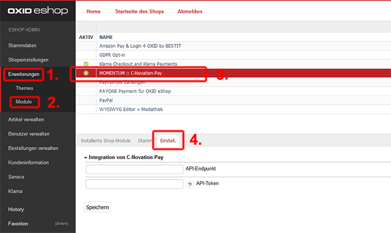
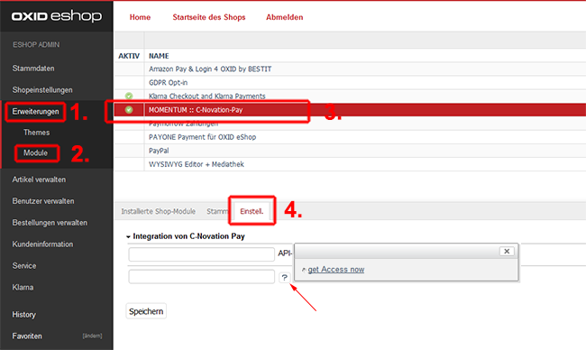

# Installation

## Installation via Composer

open terminal, move to your docroot and run following command

`composer require cryptoworxx/oxid-cnovationpay `

After that, just activate the module in the Oxid backend and clear the cache

# Configuration

Once the plugin is installed, you need to get an API token to connect it to the CNovation-Pay ecosystem. 
You may generate a new token in your portal account or you can simply click on the "?" and then on "get access now" Link on the module config screen:

A new windows opens and leads you to the process of generating an API Token.

Copy that token, paste it into the module config window and save