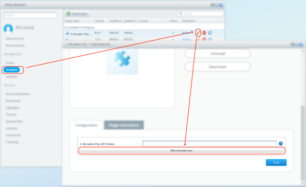
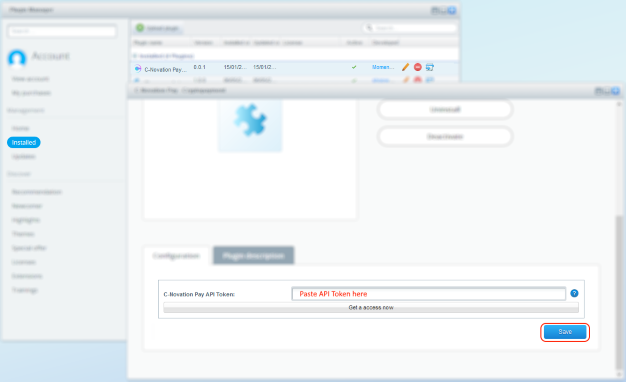
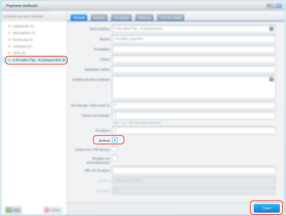

Some Shopware docs
==================
* [Simple guide (de)](https://www.the-cake-shop.de/shopware-plugin-101-einfaches-plugin-erstellen/)
* [Official startup guide (en)](https://developers.shopware.com/developers-guide/plugin-quick-start/)
* [Developer Cheat sheet (en)](https://synonymous.rocks/shopware-5-cheat-sheet-fuer-entwickler/)

Installation
============
Installing the plugin follows the standard procedure.
This is namely
* upload the plugin ZIP file    
* install it    
* configure it    
* use it    
    
    
    
Once the plugin is uploaded and installed, you need to get an API token to
connect it to the CNovation-Pay ecosystem. You may generate a new token in your portal account
or you can simply click on the "Get Token" Button the the plugin config screen:    
    

An new windows opens and leads you to the process of generating an API Token:    
    
    
    
    
Copy that token and paste it into the plugin config window:    
    
    
Now you can configure your Shopware installation to use the payment method 'C-Novation Pay'.    
    